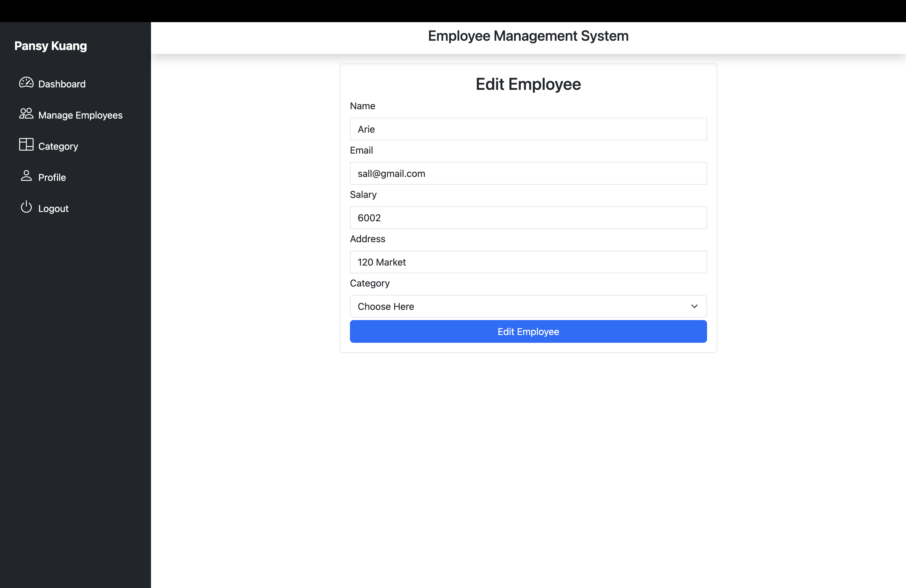

<!-- PROJECT LOGO -->
<br />
<div align="center">
  <a href="https://github.com/pakuang/employeeMS">
    
  </a>

<h3 align="center">Employee Management System</h3>

  <p align="center">
    Role-based management system with admin logins and fully customizable employee database and organization. User athentification with JWT tokenizers and hashed user data for security.
    <br />
    <a href="https://github.com/pakuang/employeeMS"><strong>Explore the docs »</strong></a>
    <br />
    <br />
    <a href="https://github.com/pakuang/employeeMS">View Demo</a>
    ·
    <a href="https://github.com/pakuang/employeeMS/issues">Report Bug</a>
    ·
    <a href="https://github.com/pakuang/employeeMS/issues">Request Feature</a>
  </p>
</div>


<!-- TABLE OF CONTENTS -->
<details>
  <summary>Table of Contents</summary>
  <ol>
    <li>
      <a href="#about-the-project">About The Project</a>
      <ul>
        <li><a href="#built-with">Built With</a></li>
      </ul>
    </li>
    <li><a href="#usage">Usage</a></li>
    <li>
      <a href="#getting-started">Getting Started</a>
      <ul>
        <li><a href="#installation">Installation</a></li>
      </ul>
    </li>
    <li><a href="#contact">Contact</a></li>
    <li><a href="#acknowledgments">Acknowledgments</a></li>
  </ol>
</details>


<!-- ABOUT THE PROJECT -->
## About The Project

This EMS application hosted through React + Vite is a game-changing solution that redefines workforce administration. With multi-level access control, effortlessly manage multiple admins and employee logins, while conducting CRUD operations on a dynamic employee database. Enhance collaboration through advanced employee categorization, all seamlessly integrated with connection to a MySQL database. Security is guaranteed with a custom JWT Tokenizer for user authentication and encrypted user data.  Revolutionize your employee management with efficiency, security, and unparalleled control at your fingertips.

<p align="right">(<a href="#readme-top">back to top</a>)</p>


### Built With

* [![Node][NodeJS]][Node-url]
* [![Next][Next.js]][Next-url]
* [![React][React.js]][React-url]
* [![Vite][Vite]][Vite-url]
* [![Bootstrap][Bootstrap.com]][Bootstrap-url]
* [![MySQL][MySQL]][MySQL-url]
* [![Express][Express.js]][Express-url]
* [![VSCode][Visual Studio Code]][VSCode-url]


<p align="right">(<a href="#readme-top">back to top</a>)</p>

<!-- USAGE EXAMPLES -->
## Usage

Admin Login Example


Main Dashboard


Employee Management and Organization





<p align="right">(<a href="#readme-top">back to top</a>)</p>

<!-- GETTING STARTED -->
## Getting Started

To get a local copy up and running follow these simple example steps.


### Installation

1. Deploy a MySQL database and note server and port details.
2. Clone the repo
   ```sh
   git clone https://github.com/pakuang/employeeMS.git
   ```
3. Install NPM packages
   ```sh
   npm install
   ```
4. Enter your database connection string and local port in `Server/utils/db.js`
   ```js
    const con= mysql.createConnection({
    host: "localhost",
    user: "root",
    password: "ENTER SERVER PASSWORD HERE",
    database: "employeems",
    port: ENTER PORT
    })

   ```
5. Run the development server in Server directory:

    ```bash
    npm start
    ```
6. Open [http://localhost:PORT](http://localhost:PORT) with your browser to see the result. 

<p align="right">(<a href="#readme-top">back to top</a>)</p>


<!-- CONTACT -->
## Contact

Pansy Kuang - [LinkedIn](https://linkedin.com/in/pansykuang) - kuangpansy@gmail.com

Project Link: [https://github.com/pakuang/employeeMS](https://github.com/pakuang/employeeMS)

<p align="right">(<a href="#readme-top">back to top</a>)</p>


<!-- MARKDOWN LINKS & IMAGES -->
<!-- https://www.markdownguide.org/basic-syntax/#reference-style-links -->
[linkedin-shield]: https://img.shields.io/badge/-LinkedIn-black.svg?style=for-the-badge&logo=linkedin&colorB=555
[linkedin-url]: https://linkedin.com/in/pansykuang


[NodeJS]: https://img.shields.io/badge/node.js-6DA55F?style=for-the-badge&logo=node.js&logoColor=white
[Node-url]: https://nodejs.org
[Next.js]: https://img.shields.io/badge/next.js-000000?style=for-the-badge&logo=nextdotjs&logoColor=white
[Next-url]: https://nextjs.org/
[React.js]: https://img.shields.io/badge/React-20232A?style=for-the-badge&logo=react&logoColor=61DAFB
[React-url]: https://reactjs.org/
[Bootstrap.com]: https://img.shields.io/badge/Bootstrap-563D7C?style=for-the-badge&logo=bootstrap&logoColor=white
[Bootstrap-url]: https://getbootstrap.com
[Express.js]: https://img.shields.io/badge/express.js-%23404d59.svg?style=for-the-badge&logo=express&logoColor=%2361DAFB
[Express-url]: https://expressjs.com
[MySQL]: https://img.shields.io/badge/mysql-%2300f.svg?style=for-the-badge&logo=mysql&logoColor=white
[MySQL-url]: https://www.mysql.com/ 
[Vite]: https://img.shields.io/badge/vite-%23646CFF.svg?style=for-the-badge&logo=vite&logoColor=white
[Vite-url]: https://vitejs.dev/
[Visual Studio Code]: https://img.shields.io/badge/Visual%20Studio%20Code-0078d7.svg?style=for-the-badge&logo=visual-studio-code&logoColor=white
[VSCode-url]: https://code.visualstudio.com/
